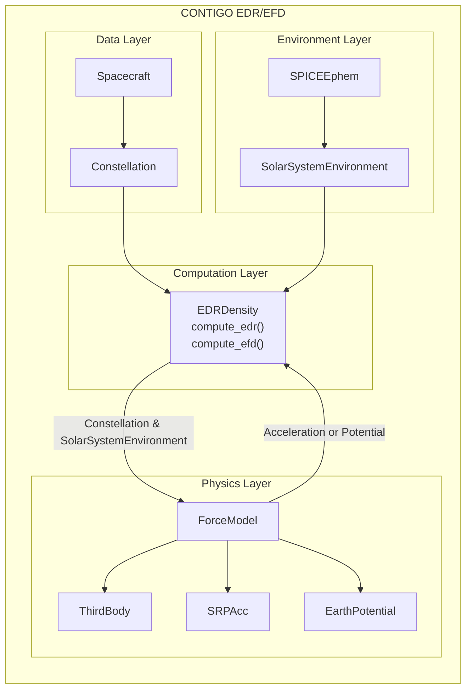

# CONTIGO

This repository implements an Energy Dissipation Rate (EDR) and Effective Density (EDF) 
framework for Earth-orbiting spacecraft.

At a high level, the module:
- Loads spacecraft orbit data (HDF, CSV, SP3, multi-satellite).
- Groups spacecraft in a Constellation
- Loads and caches solar system ephemeris
- Computes force model accelerations and Earth gravity potential
- Computes the energy dissapation rate
- Computes effective density (*to do*)

It is structured as a **modular framework** so that forces/accelerations can easily be 
added to the computation of EDR and EFD using the ```ForceModel``` template which can
then be *plugged into* the main EDR/EFD calculation ```EDRDensity```. The figure below
structure of the CONTIGO module and how the main classes fit together. The physics layer
and ```ForceModel(Protocol)``` are the interesting bits of the module and allow for
users to easily added new force/accelerations to core ```EDRDensity``` calculation.
A detailed [Overview](#overview) is below.



## Overview

### Spacecraft System
```Spacecraft``` - a flexible load/container class that:
- Accepts
    - Direct numpy arrays
    - HDF files
    - CSV/text files (can mix types and zip vs not zipped files)
    - SP3 files
- Load multiple Spacecraft
- Normalizes data in a strict internal state for computing forces
    - ```state_ecef = [x, y, z, vx, vy, vz]```
- Normalizes spacecraft time uses SPICEYPY (and SPICE)
    - SPICE ephemeris time (ET)
    - SPICE GPS time
    - SPICE UTC
- Stores spacecraft physical parameters
    - Mass, Cd, Drag Area, Cr, SRP Area

### Constellation
```Constellation``` is a wrapper around the ```Spacecraft``` class that separates 
```Spacecraft``` objects into a dictionary of unique ```Spacecraft```.

### Solar System Environment
```SPICEEphem``` controls the loading of solar system ephemeris and the required SPICE
kernels to compute ephemerides. 

```SolarSystemEnvironment``` is a high-performance ephemeris cache to reduce the loading
of solar system ephemeris if Spacecraft within a Constellation share a time axis. It
offers: 
- Time tolerance quantization, stores ephemeris by descritizing time in seconds to an
an interger using ```q_t = np.round(t/tol).astype(int)``` where ```t``` is in seconds
and ```tol``` is a frac (e.g., ```0.1, 0.01```).
- Supports lazy loading. If an ephemeris is not in the cache it loads it.

### Force Model System
All forces follow a common structure (python protocl) using the ```ForceModel``` base
class. This allows the system to be modular and easily allows users to plugin in new
Forces.

#### Current Forces
- Third body accelerations (```third_body_acc.py```) which uses spacecraft positions and
solar system ephemeris to compute accelerations.

- Solar Radiation Pressure (```srp_acc.py```) via the General Mission Analysis Tool
(GMAT) Python API. Currently uses a cannonball method.

- Earth gravatational potential (```grav_pot.py```). Computes gravatational potential
from the normalized Legendre Polynmails (PySHTOOLS) using [International Centre for 
Global Earth Models (ICGEM)](https://icgem.gfz.de/home) gravity field models which
can be downloaded [here](https://icgem.gfz.de/tom_longtime).

### EDR/EFD Engine
The ```EDRDensity``` is the core engine which pulls everthing together to calculate the
energy dissapation rate and effective density from a ```Constellation``` of satellites.

A user creates a ```Constellation``` of ```Spacecraft```, defines a solar system 
ephemeris provider ```SPICEEphem``` and ```SolarSystemEnvironment```, and defines a set
of ```ForceModels```. These are passed to the ```EDRDensity``` class which then computes
EDR and EFD for the constellation of satellites.

