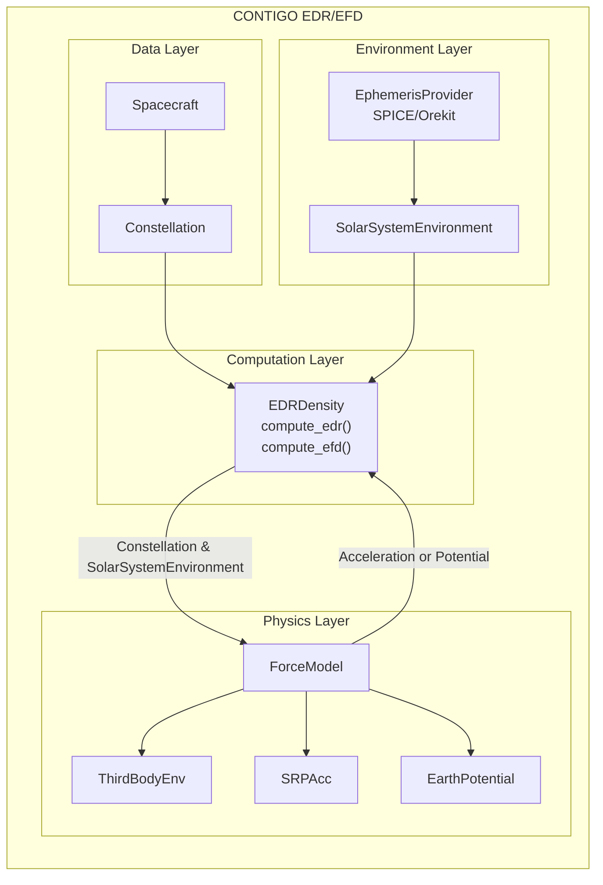

# CONTIGO

This repository implements an Energy Dissipation Rate (EDR) and Effective Density (EDF) 
framework for Earth-orbiting spacecraft. Designed for modular, extensible, and high-performance analysis.

At a high level, the module:
- Loads ```Spacecraft``` orbit data (HDF, CSV, SP3, multi-satellite).
- Groups multiple ```Spacecraft``` into a ```Constellation```
- Loads and caches solar system ephemeris
- Computes force model accelerations and Earth gravity potential
- Computes the energy dissapation rate
- Computes effective density

It is structured as a **modular framework** so that forces/accelerations can easily be 
added to the computation of EDR and EFD using the ```ForceModel``` template which can
then be *plugged into* the main EDR/EFD calculation ```EDRDensity```. The figure below
structure of the CONTIGO module and how the main classes fit together. The physics layer
and ```ForceModel(Protocol)``` are the interesting bits of the module and allow for
users to easily added new force/accelerations to core ```EDRDensity``` calculation.
A detailed [Overview](#overview) is below as well as a simple [Example](#example).



## Overview

### Data Layer
#### Spacecraft System
```Spacecraft``` - a flexible load/container class that:
- Accepts
    - Direct numpy arrays
    - HDF files
    - CSV/text files (can mix types and zip vs not zipped files)
    - SP3 files (including compressed gz and zip)
- Load multiple Spacecraft
- Normalizes data in a strict internal state for computing forces
    - ```state_ecef = [x, y, z, vx, vy, vz]```
- Normalizes spacecraft time uses SPICEYPY (and SPICE)
    - SPICE ephemeris time (ET)
    - SPICE GPS time
    - SPICE UTC
- Stores spacecraft physical parameters
    - Mass, Cd, Drag Area, Cr, SRP Area

#### Constellation
```Constellation``` is a wrapper around the ```Spacecraft``` class that separates 
```Spacecraft``` objects into a dictionary of unique ```Spacecraft```.

### Environment Layer

#### Ephemeris
Either SPICE or Orekit can be used for ephemperis via ```SPICEEphem``` or ```OrekitEphem```. 

```SPICEEphem``` controls the loading of solar system ephemeris and the required SPICE kernels to compute ephemerides. 

```OrekitEphem``` controls the loading of solar system ephemeris using the [Orekit java library](https://www.orekit.org/) and the [orekit_jpype](https://gitlab.orekit.org/orekit/orekit_jpype) Python package. ```orekit_jpype``` is a python wrapper around the Orekit Java library which uses a Java Virtual Machine to access the Orekit libary. ```OrekitEphem``` relies on a CONTIGO java backend that speeds up the computation of the grabbing of ephemeris from the Java Virtual Machine ```EphemerisBatchHelper.java``` - this code is precompiled and can is loaded whhen the Orekit Java Virtual Machine is started by adding the jar file ```orekit_utils-1.0.0.jar``` to the initialization via ```orekit.initVM(additional_classpaths=path-to-jar)```. 

```SPICEEphem``` and ```OrekitEphem``` provide the ephemeris to ```SolarSystemEnvironment```.

#### Solar System Ephemeris
```SolarSystemEnvironment``` is a high-performance ephemeris cache to reduce the loading
of solar system ephemeris if Spacecraft within a Constellation share a time axis. It
offers: 
- Time tolerance quantization, stores ephemeris by descritizing time in seconds to an
an interger using ```q_t = np.round(t/tol).astype(int)``` where ```t``` is in seconds
and ```tol``` is a frac (e.g., ```0.1, 0.01```).
- Supports lazy loading. If an ephemeris is not in the cache it loads it.

### Physics Layer 
The Force Model system forces follow a common structure (python protocl) using the 
```ForceModel``` base class. This allows the system to be modular and easily allows users 
to plugin in new Forces.

#### Current Forces
- Third body accelerations (```third_body_acc.py```) which uses spacecraft positions and
solar system ephemeris to compute accelerations.

- Solar Radiation Pressure via the General Mission Analysis Tool (GMAT, ```srp_acc.py```) Python API or from the Orekit Python wrapper (```orekit_jpype```) and the ```SRPCannonballBatchHelper.java``` backend. Currently both methods use a cannonball approach. Similar to the Orekit ephermeris the Orekit SRP calculation is provided in the same precompiled jar which is loaded when the Orekit Java Virtual Machine is initialized.

- Earth gravatational potential (```grav_pot.py```). Computes gravatational potential
from the normalized Legendre Polynmails (PySHTOOLS) using [International Centre for 
Global Earth Models (ICGEM)](https://icgem.gfz.de/home) gravity field models which
can be downloaded [here](https://icgem.gfz.de/tom_longtime).

### Computation Layer/Engine
The ```EDRDensity``` is the core engine which pulls everthing together to calculate the
energy dissapation rate and effective density from a ```Constellation``` of ```Spacecraft```.

A user creates a ```Constellation``` of ```Spacecraft```, defines a solar system ephemeris provider (```SPICEEphem``` or ```OrekitEphem```) and ```SolarSystemEnvironment```, and defines a set of ```ForceModels```. These are passed to the ```EDRDensity``` class which then computes EDR and EFD for the constellation of satellites.

## Example

Import everything we need

```python 
import pandas as pd
import numpy as np


from contigo.constellation import Constellation
from contigo.edr_efd import EDRDensity

from contigo.solar_system_ephem import SPICEEphem
from contigo.solar_system_ephem import SolarSystemEnvironment

from contigo.forces.third_body_acc import ThirdBodyAcc
from contigo.forces.third_body_acc import ThirdBody
from contigo.forces.third_body_acc import ThirdBodyEnv
from contigo.forces.grav_pot import EarthPotential
from contigo.forces.srp_acc import SRPAcc
```

Load some example data into a Constellation object

```python 
hdf_sc = Constellation(state_file=r'\contigo_edr\data\ESA_pod.hdf', 
                    time_col='DateTime', x_col='x', y_col='y', z_col='z',
                    vx_col='vx', vy_col='vy', vz_col='vz', 
                    sc_id_col='filename', sc_fn_slc=slice(-11,-8),
                    tscale_input='GPS', 
                    sc_mass=4.3e+02, cr=1.8, srp_area=1, cd=3.5, drag_area=1.1)
```

Setup the ephemeris provider and the solar system environement (attache the ephemeris 
provider to environement). Makesure to define the tolerance we want ephemeris to be 
cached at (e.g., ```tolerance=0.001``` cache ephemeris at milliseconds).

```python
ephem = SPICEEphem(ephemeris='de440s', frame='ITRF93', observer='EARTH')

env = SolarSystemEnvironment(bodies=['SUN','MOON'], tolerance=0.01, provider=ephem, 
                             sp_et=hdf_sc.sspice_et, sp_gps=hdf_sc.sspice_gps)
```

Setup the ```ForceModels``` we want to use

```python
ep = EarthPotential(lmax=40) 
tba = ThirdBody(body=['SUN','MOON'])
tba_env = ThirdBodyEnv( )
srp = SRPAcc(apistartup="path_to_gmat_api_startup", gmat_install="path_to_gmat")
```

Create the ```EDRDensity``` object and attache the ```Constellation```, 
```SolarSystemEnvironment```, and ```ForceModels```. Note that the Earths potential is
attached as it's own keyword. Then compute the EDR.

```python
edr = EDRDensity(constellation=hdf_sc,
                 solarsys_env=env, force_models=[tba_env,srp],potential_model=ep)

contigo_edr = edr.compute_edr() # dictionary, spacecraft ids as keys and edr as values
```


